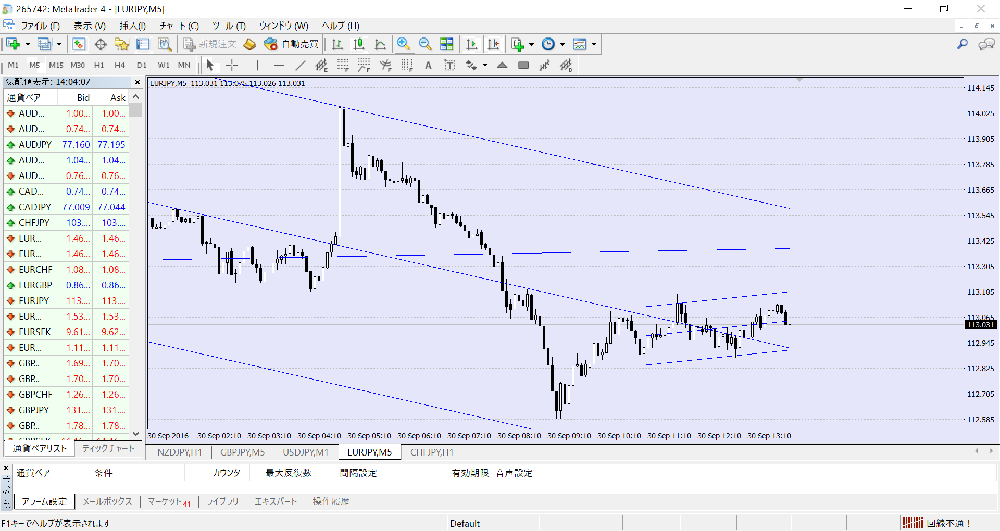

# WL_MTF_LastZigZagRegression_forMT4
ZigZag頂点・線形回帰チャネル インジケータ
MetaTrader4 用

## 概要
ZigZagの頂点を基に線形回帰チャネルを引きます。  
初期設定は、ZigZagの最後のN字・逆N字の開始点から現在値までになります。 

## 動作環境
MetaTrader4 

## ビルド
MQL4フォルダ階層に展開し、MetaEditor でコンパイルして下さい。

# スクリーンショット
 